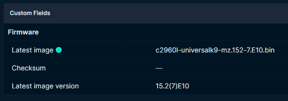
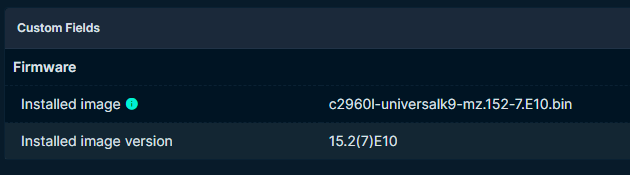

# Quick start
Create a virtual environment `python3 -m venv .venv`, source it `source .venv/bin/activate`.

Then install the projects dependencies `pip install -r requirements.txt`.

Copy the .env.example to .env `cp .env.example .env`, and set your configuration.

Run the server `python3 main.py`.

# The works
You need to add a couple of custom fields in netbox on the device context:
1. installed_image 
2. installed_image_version

And a couple of custom fields on the device type context:
1. latest_image
2. latest_image_version
3. latest_image_checksum (optional)
   
You also need to add a few tags:
1. config-needed
2. configured
3. image-needed
4. image-updated
5. install-image

You also need to configure option 43 on the DHCP server for the PnP network, this is how I've done mine.
`5A1D;K4;B2;I<serverip>;J5000`

[Read more about it](https://developer.cisco.com/site/open-plug-n-play/learn/learn-open-pnp-protocol/#options)

## Updating config
Assign the device `config-needed` tag and it will (if your config doesn't contains errors, ask me how I know) update the running config of the switch. 

## Updating OS
If the device doesn't have the latest image (specified on the device type) it will automatically be tagged with `image-needed` tag. This is only for filtering purposes. If you however add the tag `install-image` the switch will update the image and reboot.

Upload the image to the images folder on the server, and reference the full filename on the Device type in netbox.
Like this:

When the switch first starts up it will register with the custom fields added:

# Acknowledgements

This project is based on [dmfigol's cisco-pnp-server](https://github.com/dmfigol/cisco-pnp-server) from the article at [netboxlabs](https://netboxlabs.com/blog/how-to-auto-provision-devices-with-netbox-and-cisco-pnp-provision/) and [Cisco day0 provisioning](https://thl-cmk.hopto.org/gitlab/bits-and-bytes/cisco_day0_provision/-/tree/main).

